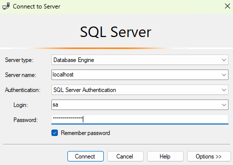

<p align="center">
  <a href="https://www.microsoft.com/sql-server" target="_blank">
    
  </a>
</p>

## Table of Contents

- [📰 About](#about)
- [⚡️ Requirements](#requirements)
- [📦 Installation](#installation)
- [🚀 Usage](#usage)
- [⚙️ Configuration](#configuration)
- [📝 License](#license)

<h2 id="about">📰 About</h2>

[Microsoft SQL Server](https://wwww.microsoft.com/sql-server) **is a relational
database management system** (RDBMS). Applications and tools connect to a
SQL Server _instance or database_, and communicate using
[Transact-SQL](https://learn.microsoft.com/sql/t-sql) (T-SQL).

> [!IMPORTANT]
>
> **Disclaimer**: This repository is provided for educational and development
> purposes only.  
> It is not affiliated with, endorsed by, or officially maintained by the
> respective software or database vendors.
>
> The provided configurations and templates are intended as starting points and
> may require adjustments for production environments.
> Use them at your own discretion.

<h2 id="requirements">⚡️ Requirements</h2>

- [Docker Engine](https://docs.docker.com/get-docker/) >= [20.10.0](https://github.com/docker/cli/releases/tag/v20.10.0)
- [Docker Compose](https://docs.docker.com/compose/install/) >= [2.0.0](https://github.com/docker/compose/releases/tag/v2.0.0)

<h2 id="installation">📦 Installation</h2>

Clone this repository:

```sh
$ git clone https://github.com/alexnoleaz/docker-compose-samples.git
```

Navigate to the `databases/mssql` directory:

```sh
$ cd docker-compose-samples/databases/mssql
```

<h2 id="usage">🚀 Usage</h2>

To start the container, run the Microsoft SQL Server container in detached mode:

```sh
$ docker compose up -d
```

To verify that the container is running and the port mapping is configured correctly:

```sh
$ docker ps
CONTAINER ID   IMAGE                                   COMMAND                  CREATED          STATUS          PORTS                    NAMES
ea4154cba633   mcr.microsoft.com/mssql/server:latest   "/opt/mssql/bin/perm…"   32 seconds ago   Up 32 seconds   0.0.0.0:1433->1433/tcp   mssql
```

To stop and remove the container:

```sh
$ docker compose down
```

<h2 id="configuration">⚙️ Configuration</h2>

> [!NOTE]
>
> This container includes a default configuration.  
> If customization is needed, ensure changes are applied **BEFORE** starting
> the container.

Create `.env` from `.env.template`:

```sh
$ cp .env.template .env
```

Edit `.env` with your preferred text editor:

```.env
# WARNING:
# For production:
# - Use more secure credentials (e.g., strong passwords).
# - Avoid using 'latest' versions of images, specify a fixed version.
# - Consider using Docker Secrets for secure management of sensitive information.

# Container name (default: mssql)
CONTAINER_NAME=

# Restart policy for the container (default: always)
RESTART_POLICY=

# Microsoft SQL Server image tag (default: latest)
IMAGE_TAG=

# Microsoft SQL Server sa password (default: Example123@Secure!)
DB_SA_PASSWORD=

# Microsoft SQL Server product id (default: Developer)
DB_PID=

# Port mapping for Microsoft SQL Server (default: 1433)
DB_PORT=

# Volume name for Microsoft SQL Server data (default: mssql_data)
VOLUME_DATA_NAME=

# Network name (default: local_dbs_network)
NETWORK_NAME=
```

For advanced configurations, you should edit the `compose.yml` file directly.
This allows you to:

- Add additional services.
- Configure more complex networking options.
- Set up custom volumes or environment variables.
- Define resource constraints and deployment strategies.

```yml
# WARNING:
# This configuration is optimized for development environments.
# In a production environment, consider:
# - Using specific image versions rather than 'latest'.
# - Changing the restart policy to 'on-failure' or a more controlled setting.
# - Using Docker Secrets or another secure method to handle sensitive data (e.g., strong passwords).
# - Adjusting the volumes and networks to be more robust and secure.

# Docker services configuration.
services:
  mssql:
    # Container name (uses CONTAINER_NAME from .env, defaults to 'mssql')
    container_name: ${CONTAINER_NAME:-mssql}

    # Restart policy for the container (uses RESTART_POLICY from .env, defaults to 'always')
    restart: ${RESTART_POLICY:-always}

    # https://hub.docker.com/r/microsoft/mssql-server
    # Microsoft SQL Server image tag (uses IMAGE_TAG from .env, defaults to 'latest')
    image: mcr.microsoft.com/mssql/server:${IMAGE_TAG:-latest}

    environment:
      # Microsoft SQL Server sa password (uses DB_SA_PASSWORD from .env, defaults to 'Example123@Secure!')
      MSSQL_SA_PASSWORD: ${DB_SA_PASSWORD:-Example123@Secure!}

      # Microsoft SQL Server product id (uses DB_PID from .env, defaults to 'Developer')
      MSSQL_PID: ${DB_PID:-Developer}

      ACCEPT_EULA: Y

    ports:
      # Port mapping for Microsoft SQL Server (uses DB_PORT from .env, defaults to 1433)
      - ${DB_PORT:-1433}:1433

    volumes:
      - mssql_data:/var/opt/mssql

    networks:
      - local

# Docker volumes configuration.
volumes:
  mssql_data:
    # Volume name for Microsoft SQL Server data (uses VOLUME_DATA_NAME from .env, defaults to 'mssql_data')
    name: ${VOLUME_DATA_NAME:-mssql_data}
    driver: local

# Docker networks configuration.
networks:
  local:
    # Network name (uses NETWORK_NAME from .env, defaults to 'local_dbs_network')
    name: ${NETWORK_NAME:-local_dbs_network}
    driver: bridge
```

---

Below is a screenshot of the configuration used in Microsoft SQL Server Management Studio:

<p align="center">
  <a
    href="https://github.com/alexnoleaz/docker-compose-samples/blob/main/databases/mssql/images/mssql-management-studio.png"
    target="_blank">
    
  </a>
</p>

<h2 id="license">📝 License</h2>

This project is licensed under the [MIT License](https://github.com/alexnoleaz/docker-compose-samples/blob/main/LICENSE).
