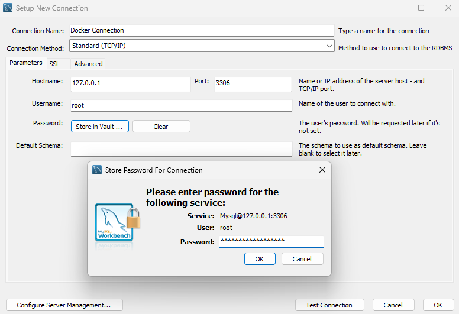

<p align="center">
  <a href="https://www.mysql.com" target="_blank">
    
  </a>
</p>

## Table of Contents

- [📰 About](#about)
- [⚡️ Requirements](#requirements)
- [📦 Installation](#installation)
- [🚀 Usage](#usage)
- [⚙️ Configuration](#configuration)
- [📝 License](#license)

<h2 id="about">📰 About</h2>

[MySQL](https://github.com/mysql/mysql-server), **the most popular Open Source
SQL database management system**, is developed, distributed, and supported by
[Oracle Corporation](https://www.oracle.com).

> [!IMPORTANT]
>
> **Disclaimer**: This repository is provided for educational and development
> purposes only.  
> It is not affiliated with, endorsed by, or officially maintained by the
> respective software or database vendors.
>
> The provided configurations and templates are intended as starting points and
> may require adjustments for production environments.
> Use them at your own discretion.

<h2 id="requirements">⚡️ Requirements</h2>

- [Docker Engine](https://docs.docker.com/get-docker/) >= [20.10.0](https://github.com/docker/cli/releases/tag/v20.10.0)
- [Docker Compose](https://docs.docker.com/compose/install/) >= [2.0.0](https://github.com/docker/compose/releases/tag/v2.0.0)

<h2 id="installation">📦 Installation</h2>

Clone this repository:

```sh
$ git clone https://github.com/alexnoleaz/docker-compose-samples.git
```

Navigate to the `databases/mysql` directory:

```sh
$ cd docker-compose-samples/databases/mysql
```

<h2 id="usage">🚀 Usage</h2>

To start the container, run the MySQL container in detached mode:

```sh
$ docker compose up -d
```

To verify that the container is running and the port mapping is configured correctly:

```sh
$ docker ps
CONTAINER ID   IMAGE          COMMAND                  CREATED          STATUS          PORTS                               NAMES
8052d43903e5   mysql:latest   "docker-entrypoint.s…"   23 seconds ago   Up 23 seconds   0.0.0.0:3306->3306/tcp, 33060/tcp   mysql
```

To stop and remove the container:

```sh
$ docker compose down
```

<h2 id="configuration">⚙️ Configuration</h2>

> [!NOTE]
>
> This container includes a default configuration.  
> If customization is needed, ensure changes are applied **BEFORE** starting
> the container.

Create `.env` from `.env.template`:

```sh
$ cp .env.template .env
```

Edit `.env` with your preferred text editor:

```.env
# WARNING:
# For production:
# - Use more secure credentials (e.g., strong passwords).
# - Avoid using 'latest' versions of images, specify a fixed version.
# - Consider using Docker Secrets for secure management of sensitive information.

# Container name (default: mysql)
CONTAINER_NAME=

# Restart policy for the container (default: always)
RESTART_POLICY=

# MySQL image tag (default: latest)
IMAGE_TAG=

# MySQL root password (default: Example123@Secure!)
DB_ROOT_PASSWORD=

# Port mapping for MySQL (default: 3306)
DB_PORT=

# Volume name for MySQL data (default: mysql_data)
VOLUME_DATA_NAME=

# Network name (default: local_dbs_network)
NETWORK_NAME=
```

For advanced configurations, you should edit the `compose.yml` file directly.
This allows you to:

- Add additional services.
- Configure more complex networking options.
- Set up custom volumes or environment variables.
- Define resource constraints and deployment strategies.

```yml
# WARNING:
# This configuration is optimized for development environments.
# In a production environment, consider:
# - Using specific image versions rather than 'latest'.
# - Changing the restart policy to 'on-failure' or a more controlled setting.
# - Using Docker Secrets or another secure method to handle sensitive data (e.g., strong passwords).
# - Adjusting the volumes and networks to be more robust and secure.

# Docker services configuration.
services:
  mysql:
    # Container name (uses CONTAINER_NAME from .env, defaults to 'mysql')
    container_name: ${CONTAINER_NAME:-mysql}

    # Restart policy for the container (uses RESTART_POLICY from .env, defaults to 'always')
    restart: ${RESTART_POLICY:-always}

    # https://hub.docker.com/_/mysql
    # MySQL image tag (uses IMAGE_TAG from .env, defaults to 'latest')
    image: mysql:${IMAGE_TAG:-latest}

    environment:
      # MySQL root password (uses DB_ROOT_PASSWORD from .env, defaults to 'Example123@Secure!')
      MYSQL_ROOT_PASSWORD: ${DB_ROOT_PASSWORD:-Example123@Secure!}

    ports:
      # Port mapping for MySQL (uses DB_PORT from .env, defaults to 3306)
      - ${DB_PORT:-3306}:3306

    volumes:
      - mysql_data:/var/lib/mysql

    networks:
      - local

# Docker volumes configuration.
volumes:
  mysql_data:
    # Volume name for MySQL data (uses VOLUME_DATA_NAME from .env, defaults to 'mysql_data')
    name: ${VOLUME_DATA_NAME:-mysql_data}
    driver: local

# Docker networks configuration.
networks:
  local:
    # Network name (uses NETWORK_NAME from .env, defaults to 'local_dbs_network')
    name: ${NETWORK_NAME:-local_dbs_network}
    driver: bridge
```

---

Below is a screenshot of the configuration used in MySQL Workbench:

<p align="center">
  <a
    href="https://github.com/alexnoleaz/docker-compose-samples/blob/main/databases/mysql/images/mysql-workbench.png"
    target="_blank">
    
  </a>
</p>

<h2 id="license">📝 License</h2>

This project is licensed under the [MIT License](https://github.com/alexnoleaz/docker-compose-samples/blob/main/LICENSE).
